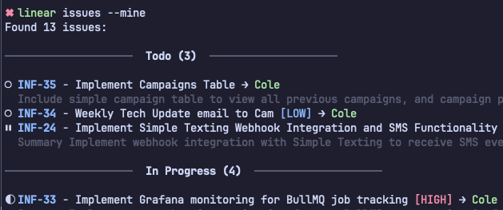

# Linear CLI - Command Line Interface for Linear.app

A fast, powerful terminal client for Linear project management. Access Linear's GraphQL API directly from your command line to manage issues, projects, and teams without leaving your terminal. Built with Rust for speed and reliability.

**Perfect for developers who want to:**
- Create and update Linear issues without switching to a browser
- Automate Linear workflows with scripts  
- Perform bulk operations on issues and projects
- Stay in the terminal while managing project tasks



## Why Use Linear CLI?

- **Speed**: No browser needed - manage Linear issues at terminal speed
- **Automation**: Script your workflows and integrate with other tools
- **Focus**: Stay in your development environment without context switching
- **Power**: Bulk operations and advanced filtering not available in the web UI

## Key Features

✅ **Full Linear API Access**: Create, read, update, and delete issues and projects  
✅ **Advanced Search & Filtering**: Powerful query language with field operators and saved searches  
✅ **Bulk Operations**: Update, move, or archive multiple issues at once  
✅ **Comments Management**: Full CRUD operations on issue comments with markdown support  
✅ **Smart Filtering**: Filter by status, assignee, team, priority, or search text  
✅ **Beautiful Output**: Color-coded terminal display with status grouping  
✅ **Multiple Formats**: Export to JSON, table view, or simple text  
✅ **Secure Authentication**: API key management with environment variables  
✅ **Cross-platform**: Works on macOS, Linux, and Windows (WSL)  
✅ **Blazing Fast**: Built with Rust for instant response times  

## Installation

### macOS/Linux via Direct Download (Recommended)
```bash
curl -sSL https://raw.githubusercontent.com/colerafiz/linear-4-terminal/main/install.sh | bash
```

### Build from Source
```bash
# Install from GitHub
cargo install --git https://github.com/colerafiz/linear-4-terminal

# Or clone and build locally
git clone https://github.com/colerafiz/linear-4-terminal
cd linear-4-terminal
cargo install --path .
```

### Homebrew (Coming Soon)
```bash
# Once the tap is set up:
brew tap colerafiz/tap
brew install linear-cli
```

### Prerequisites
- For direct download: No prerequisites needed
- For building from source: Rust and Cargo ([Install Rust](https://rustup.rs/))
- Linear API key ([Get your API key](https://linear.app/settings/api))

## Configuration

### Set up Authentication

1. **Get your Linear API key:**
   - Go to [Linear Settings > API](https://linear.app/settings/api)
   - Create a new personal API key
   - Copy the key

2. **Configure the CLI:**
```bash
# Method 1: Use the auth command
linear auth --api-key lin_api_your_key_here

# Method 2: Set environment variable
export LINEAR_API_KEY=lin_api_your_key_here
```

3. **Verify authentication:**
```bash
linear whoami
linear auth --show
```

## Quick Start - Linear Terminal Commands

Get started in 30 seconds:

```bash
# 1. Install
curl -sSL https://raw.githubusercontent.com/coderafiz/linear-4-terminal/main/install.sh | bash

# 2. Authenticate with your Linear API key
linear auth --api-key YOUR_LINEAR_API_KEY

# 3. Start using Linear from your terminal!
linear issues --mine
```

## Usage - Complete Linear CLI Reference

### Authentication Commands

```bash
# Set API key
linear auth --api-key lin_api_your_key_here

# Show current API key (masked)
linear auth --show
```

### Issue Commands

#### List Issues
```bash
# List all issues (default: 50 most recent)
linear issues

# Filter by status
linear issues --todo           # Todo/Backlog issues
linear issues --triage         # Issues in triage
linear issues --progress       # Issues in progress
linear issues --done           # Completed issues

# Filter by assignee
linear issues --mine           # Issues assigned to you
linear issues --assignee user@example.com

# Filter by team
linear issues --team ENG       # Issues from ENG team

# Search issues
linear issues --search "bug"   # Search in titles

# Combine filters
linear issues --mine --progress --team ENG

# Limit results and format output
linear issues --limit 10 --format table
linear issues --format json > issues.json
```

#### Create Issues
```bash
# Basic issue creation
linear create issue "Fix login bug" "Users can't log in"

# With additional parameters
linear create issue "New feature" "Implement dark mode" \
  --team ENG \
  --priority high \
  --assignee user_id_here \
  --labels label_id_1 label_id_2

# Priority levels: none/0, low/1, medium/2, high/3, urgent/4
linear create issue "Urgent fix" "Critical bug" --priority urgent
```

#### Update Issues
```bash
# Update issue title
linear update issue issue_id --title "New title"

# Update multiple fields
linear update issue issue_id \
  --title "Updated title" \
  --description "New description" \
  --priority high \
  --state state_id

# Change assignee
linear update issue issue_id --assignee user_id

# Update labels
linear update issue issue_id --labels label_id_1 label_id_2
```

#### Delete Issues
```bash
# Archive an issue
linear delete issue issue_id
```

### Project Commands

#### List Projects
```bash
# List all projects
linear projects
```

#### Create Projects
```bash
# Basic project creation
linear create project "Q4 Initiative" "Major improvements for Q4"

# With teams
linear create project "Mobile App" "iOS and Android apps" \
  --teams team_id_1 team_id_2
```

#### Update Projects
```bash
# Update project name
linear update project project_id --name "New name"

# Update multiple fields
linear update project project_id \
  --name "Updated project" \
  --description "New description" \
  --state "backlog"
```

#### Delete Projects
```bash
# Archive a project
linear delete project project_id
```

### Team Commands

```bash
# List all teams
linear teams
```

### User Commands

```bash
# Show current user info
linear whoami
```

### Advanced Search and Filtering (v2)

```bash
# Use advanced filter queries
linear issues -f "assignee:john@example.com AND priority:>2"
linear issues -f "title:~bug AND created:>1week"
linear issues -f "has-label:urgent AND state:started"
linear issues -f "no-assignee AND updated:<2days"

# Available operators
# : (equals), :> (greater than), :< (less than)
# :~ (contains), :!= (not equals), :in (in list)
# Special: has-assignee, no-assignee, has-label:name, no-label

# Save frequently used searches
linear search save high-priority "priority:>2 AND state:started"
linear search save my-urgent "assignee:me AND priority:urgent"
linear search save recent-bugs "title:~bug AND created:<1week"

# List saved searches
linear search list

# Run a saved search
linear search run high-priority
linear search run my-urgent --format table

# Delete a saved search
linear search delete high-priority
```

### Comments Management (v2)

```bash
# List all comments on an issue
linear comment list INF-36

# Add a comment to an issue
linear comment add INF-36 "This is looking good, just needs tests"

# Update an existing comment
linear comment update comment_id "Updated comment text"

# Delete a comment
linear comment delete comment_id
```

### Bulk Operations (v2)

```bash
# Update multiple issues at once
linear bulk update INF-1,INF-2,INF-3 --state done
linear bulk update INF-4 INF-5 --assignee john@example.com --priority high

# Move multiple issues to a different team/project
linear bulk move INF-10,INF-11,INF-12 --team ENG
linear bulk move INF-20 INF-21 --project project_id

# Archive multiple issues
linear bulk archive INF-30,INF-31,INF-32

# Update with labels
linear bulk update INF-40,INF-41 --labels label1,label2 --remove-labels old_label
```

### View Single Issue Details

```bash
# Get comprehensive details about a specific issue
linear issue INF-36
```

## Output Formats

The CLI supports multiple output formats:

### Simple Format (Default)
```bash
linear issues
# • issue-id - Issue Title (Status)
```

### Table Format
```bash
linear issues --format table
# ID                   Title                        State     Team    Assignee
# -------------------------------------------------------------------------
# abc123              Fix login bug                Todo      ENG     John Doe
```

### JSON Format
```bash
linear issues --format json
# Full JSON output with all issue data
```

## Examples

### Common Linear Terminal Workflows

```bash
# Check your assigned issues
linear issues --mine

# Check what's in triage for your team
linear issues --triage --team ENG

# Create a bug report
linear create issue "Login button not working" \
  "The login button doesn't respond on mobile devices" \
  --team ENG --priority high

# Check team progress
linear issues --progress --team ENG --format table

# Search for specific issues
linear issues --search "authentication" --format table
```

### Project Management Examples

```bash
# Review all projects
linear projects

# Create a new project
linear create project "Website Redesign" \
  "Complete overhaul of company website" \
  --teams design_team_id eng_team_id

# Check issues for a specific project
linear issues --search "website"
```

### Reporting Examples

```bash
# Generate JSON report of all completed issues
linear issues --done --format json > completed_issues.json

# Get table view of current sprint
linear issues --progress --format table

# Export team's backlog
linear issues --backlog --team ENG --limit 100 --format json > backlog.json
```

## Configuration File

The CLI stores configuration in `~/.linear-cli-config.json`:

```json
{
  "api_key": "lin_api_your_key_here",
  "default_team_id": "team_id_here"
}
```

## Error Handling

The CLI provides helpful error messages:

```bash
# No API key configured
$ linear issues
Error: No API key found. Set LINEAR_API_KEY environment variable or run 'linear auth' to configure.

# Invalid team
$ linear create issue "Test" --team INVALID
Error: Team 'INVALID' not found

# GraphQL errors are displayed clearly
$ linear create issue ""
Error: GraphQL errors: Issue title cannot be empty
```

## Advanced Features

### Environment Variables

```bash
# Set API key via environment
export LINEAR_API_KEY=lin_api_your_key_here

# Override default team
export LINEAR_DEFAULT_TEAM=ENG
```

### Scripting Examples

```bash
#!/bin/bash
# Daily standup script

echo "=== My Issues in Progress ==="
linear issues --mine --progress --format table

echo -e "\n=== Triage Items for My Team ==="
linear issues --triage --team ENG --format table

echo -e "\n=== Recently Completed ==="
linear issues --mine --done --limit 5
```

```bash
#!/bin/bash
# Create issue from git commit
COMMIT_MSG=$(git log -1 --pretty=%B)
BRANCH_NAME=$(git branch --show-current)

linear create issue "Fix: $BRANCH_NAME" "$COMMIT_MSG" \
  --team ENG --priority medium
```

## API Coverage

This CLI covers the major Linear API operations:

### Queries
- ✅ Get viewer information
- ✅ List issues with filtering
- ✅ List teams
- ✅ List projects
- ✅ Search functionality
- ✅ View single issue details
- ✅ List comments on issues

### Mutations
- ✅ Create issues
- ✅ Create projects
- ✅ Update issues
- ✅ Update projects
- ✅ Delete operations (archive)
- ✅ Create comments
- ✅ Update comments
- ✅ Delete comments
- ✅ Bulk update issues
- ✅ Bulk move issues
- ✅ Bulk archive issues

### Filters & Search
- ✅ State-based filtering (todo, triage, progress, done)
- ✅ Assignee filtering
- ✅ Team filtering
- ✅ Search/text filtering
- ✅ Pagination with limits
- ✅ Advanced query language with operators
- ✅ Field-specific filters (priority, created, updated, labels)
- ✅ Relative date filtering
- ✅ Saved searches

## Troubleshooting

### Common Issues

1. **Authentication Errors**
   ```bash
   # Verify your API key
   linear auth --show
   linear whoami
   ```

2. **Team Not Found**
   ```bash
   # List available teams first
   linear teams
   ```

3. **Rate Limiting**
   The CLI respects Linear's rate limits. If you hit limits, wait a moment and try again.

4. **Network Issues**
   ```bash
   # Check connectivity to Linear's API
   curl -I https://api.linear.app/graphql
   ```

### Debug Mode

For debugging, you can inspect the API calls by modifying the code to add debug logging or use tools like `RUST_LOG=debug cargo run`.

## Future Plans & Roadmap

We're actively working on expanding the Linear CLI with powerful new features. Here's what's coming:

### 🚧 In Development (v2)
- ✅ **Comments Management**: Full CRUD operations for issue comments
- ✅ **Bulk Operations**: Batch update, move, and archive issues
- ✅ **Advanced Search**: Query language with operators and saved searches

### 📋 Planned Features (Priority Order)

#### Medium Priority
1. **Sprint/Cycle Management**
   - Create and manage sprints/cycles
   - Sprint planning and burndown charts
   - Add/remove issues from sprints
   - Sprint progress tracking

2. **Issue Dependencies & Relationships**
   - Link related issues, blockers, and dependencies
   - Visualize dependency chains
   - Block/unblock workflows

3. **Git Integration**
   - Create commits with issue references
   - Link PRs to issues
   - Update issue status from git hooks
   - Branch naming conventions

4. **Time Tracking & Estimates**
   - Log time on issues
   - Set and track estimates
   - Time reports and summaries
   - Velocity calculations

5. **Advanced Reporting**
   - Daily/weekly standup reports
   - Team workload analysis
   - Progress tracking dashboards
   - Custom report generation

#### Low Priority
6. **Shell Completion**
   - Bash, Zsh, Fish completions
   - Context-aware suggestions
   - Command aliases

7. **Interactive Mode**
   - Menu-driven interface
   - Guided workflows
   - Issue templates

8. **Offline Mode**
   - Queue changes when offline
   - Automatic sync on reconnection
   - Conflict resolution

### 🎯 Long-term Vision

- **Plugin System**: Extend functionality with custom plugins
- **Webhook Integration**: React to Linear events
- **AI Assistant**: Natural language commands
- **Mobile Companion**: CLI commands from mobile
- **Team Analytics**: Advanced metrics and insights

## Contributing

Contributions are welcome! Check our [roadmap](#future-plans--roadmap) above to see what we're working on.

Ways to contribute:
- Pick a feature from the roadmap
- Report bugs or suggest features in [issues](https://github.com/colerafiz/linear-4-terminal/issues)
- Improve documentation
- Add tests
- Share feedback and use cases

## Related Projects and Alternatives

- **Linear Web App**: The official Linear.app web interface
- **Linear API**: Direct GraphQL API access for custom integrations
- **Linear CLI**: This terminal-based Linear client for developers

## Keywords for Search

Linear CLI, Linear terminal, Linear command line, Linear.app CLI, Linear API client, terminal Linear app, command line project management, Linear issue tracker terminal, Linear GraphQL client, Rust Linear integration

## License

MIT License - free to use and modify for your Linear workflow automation needs.
