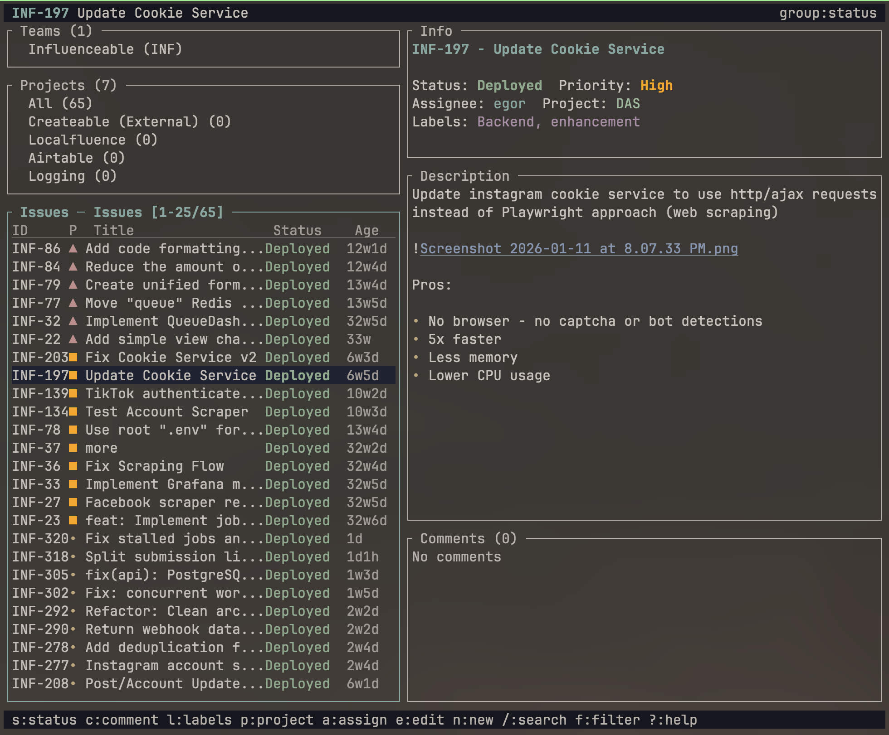

# Linear 4 Terminal

A Rust-based terminal client for Linear.app.

Use it to read, create, and update issues, projects, and comments without opening the web app. Includes a fullscreen interactive mode for fast terminal workflows.



## Installation

### Direct install (recommended)

```bash
curl -sSL https://raw.githubusercontent.com/colerafiz/linear-4-terminal/main/install.sh | bash
```

### Install from source

```bash
cargo install --git https://github.com/colerafiz/linear-4-terminal
```

Or:

```bash
git clone https://github.com/colerafiz/linear-4-terminal
cd linear-4-terminal
cargo install --path .
```

## Authentication

Linear CLI expects a Linear API key.

```bash
linear auth YOUR_LINEAR_API_KEY
# optional: also available via env var
export LINEAR_API_KEY=YOUR_LINEAR_API_KEY
```

## Verify setup

```bash
linear whoami
linear auth --show
```

## Quick usage

```bash
linear issues --mine
linear issues --progress --team ENG --format table
linear create issue "Fix login bug" "Users can't log in" --team ENG --priority high
linear issue INF-36
linear projects
linear teams
```

## Commands

### Issues

```bash
linear issues                     # latest issues
linear issues --todo
linear issues --progress
linear issues --done
linear issues --mine
linear issues --assignee user@example.com
linear issues --search "error"
linear issues --team ENG --limit 25
linear issues -f "assignee:me AND priority:>2"
linear issues --format json
linear issue INF-36
```

### Create / update / archive issues

```bash
linear create issue "Title" "Description" --team ENG --priority high
linear update issue INF-36 --title "Updated title" --description "Updated description"
linear update issue INF-36 --state 4 --assignee user_id_here
linear update issue INF-36 --labels label_id_1 label_id_2
linear delete issue INF-36
```

### Projects and teams

```bash
linear projects
linear create project "Project name" "Description" --teams team_id_1
linear update project PROJECT_ID --name "New name"
linear delete project PROJECT_ID
linear teams
```

### Comments

```bash
linear comment list INF-36
linear comment add INF-36 "Looks good, merging today"
linear comment update COMMENT_ID "Updated text"
linear comment delete COMMENT_ID
```

### Search helpers

```bash
linear search save urgent "priority:urgent AND state:started"
linear search list
linear search run urgent
linear search delete urgent
```

### Bulk actions

```bash
linear bulk update INF-1,INF-2 --state done
linear bulk move INF-3,INF-4 --team ENG
linear bulk archive INF-5,INF-6
linear bulk update INF-7,INF-8 --labels label1,label2 --remove-labels old_label
```

### Git integration

```bash
linear git branch INF-36
linear git branch INF-36 --prefix bugfix
linear git commit "Fix null pointer exception" --issue INF-36
linear git commit "Implement retry logic" --push
linear git pr
linear git pr --title "Fix: auth flow" --body "Resolves login flow bugs"
```

## Interactive mode

Run interactive mode with no arguments:

```bash
linear
# or
linear interactive
```

Shortcuts:
- `j/k`, `↑/↓` navigate the list
- `Enter` open issue details
- `/` filter by text
- `s` status, `c` comment, `l` labels, `p` project
- `e` full edit mode, `r` refresh, `g` toggle grouping
- `q` or `Esc` to quit

## Output formats

```bash
linear issues --format table
linear issues --format json
linear issues --format simple
```

## Configuration file

`~/.linear-cli-config.json` stores defaults such as API key and team configuration.

### Example

```json
{
  "api_key": "lin_api_your_key_here",
  "default_team_id": "team_id_here"
}
```

## Environment variables

```bash
export LINEAR_API_KEY=lin_api_your_key_here
export LINEAR_DEFAULT_TEAM=ENG
```

## Troubleshooting

### Missing API key

```bash
linear issues
# No API key found...
linear auth YOUR_KEY
```

### Team or ID not found

```bash
linear teams
linear projects
```

### API/JSON output errors

Add JSON debugging while developing:

```bash
RUST_LOG=debug cargo run -- issues
```

## Development

```bash
cargo build
cargo build --release
cargo run -- interactive
cargo test
```

## Contributing

Open issues or submit pull requests in this repository.

- Keep command behavior stable unless documented
- Add tests for command handling and parsing changes
- Prefer direct, deterministic output in scripts when adding format variants

## License

MIT License.
