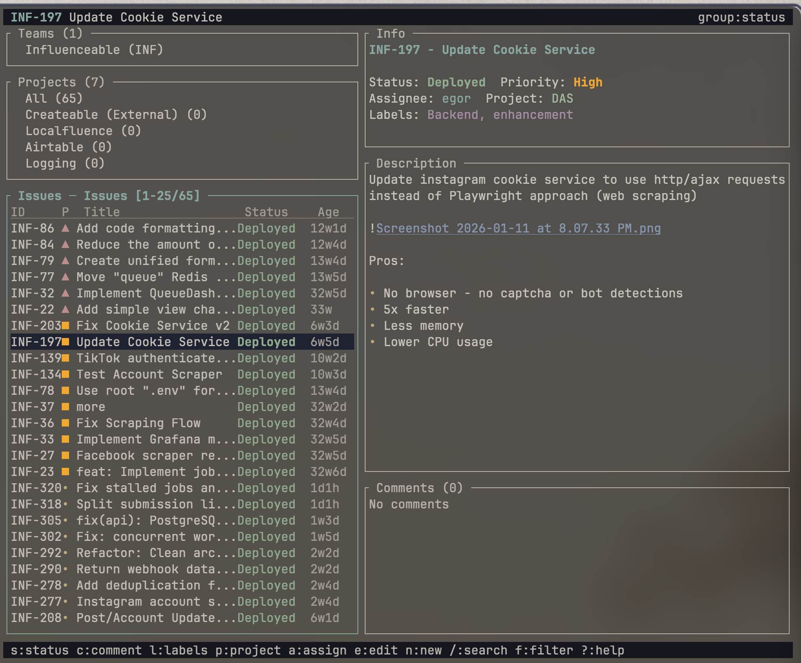

# Linear 4 Terminal

A fast terminal client for [Linear](https://linear.app). Browse, create, and update issues without leaving the terminal.



## Install

```bash
cargo install --git https://github.com/nooesc/linear-4-terminal
```

## Setup

```bash
linear auth YOUR_LINEAR_API_KEY
```

## Usage

### Interactive mode (default)

```bash
linear
```

| Key | Action |
|-----|--------|
| `j/k`, `↑/↓` | Navigate list |
| `Shift+j/k`, `Shift+↑/↓` | Jump 5 items |
| `→` or `Enter` | Open issue detail |
| `←` or `Esc` | Go back |
| `Tab` | Cycle panels |
| `/` | Search / filter |
| `s` | Change status |
| `c` | Comment |
| `l` | Labels |
| `p` | Project |
| `a` | Assign |
| `e` | Edit |
| `n` | New issue |
| `x` | Multi-select |
| `Space` | Bulk action (with selection) |
| `r` | Refresh |
| `g` | Toggle grouping |
| `q` | Quit |

Two-panel layout on wide terminals (100+ cols), single-panel with arrow key navigation on narrow terminals.

### CLI

```bash
linear issues --mine
linear issues --team ENG --format table
linear issue INF-36
linear create issue "Title" "Description" --team ENG --priority high
linear update issue INF-36 --state done
```

<details>
<summary>All commands</summary>

#### Issues

```bash
linear issues                          # latest issues
linear issues --todo / --progress / --done
linear issues --mine
linear issues --assignee user@example.com
linear issues --search "error"
linear issues --team ENG --limit 25
linear issues -f "assignee:me AND priority:>2"
linear issues --format json
linear issue INF-36
```

#### Create / update / delete

```bash
linear create issue "Title" "Desc" --team ENG --priority high
linear update issue INF-36 --title "New title"
linear update issue INF-36 --state 4 --assignee user_id
linear update issue INF-36 --labels label1 label2
linear delete issue INF-36
```

#### Projects and teams

```bash
linear projects
linear teams
linear create project "Name" "Desc" --teams team_id
linear update project ID --name "New name"
linear delete project ID
```

#### Comments

```bash
linear comment list INF-36
linear comment add INF-36 "Looks good"
linear comment update COMMENT_ID "Updated"
linear comment delete COMMENT_ID
```

#### Bulk actions

```bash
linear bulk update INF-1,INF-2 --state done
linear bulk move INF-3,INF-4 --team ENG
linear bulk archive INF-5,INF-6
```

#### Search helpers

```bash
linear search save urgent "priority:urgent AND state:started"
linear search list
linear search run urgent
linear search delete urgent
```

#### Git integration

```bash
linear git branch INF-36
linear git commit "Fix bug" --issue INF-36
linear git pr
```

#### Output formats

```bash
linear issues --format table
linear issues --format json
linear issues --format simple
```

</details>

## Configuration

```bash
# Environment variables
export LINEAR_API_KEY=lin_api_your_key_here
export LINEAR_DEFAULT_TEAM=ENG
```

Config file: `~/.linear-cli-config.json`

## License

MIT
